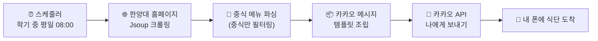

# 🍱 Monkey-Monkey — 한양대 학식 알림 봇

> 매일 아침, 한양대 학식 메뉴를 크롤링해 카카오톡으로 자동 배달해주는 Spring Boot 기반 알림 봇.
> "매일 식단을 확인하고 캡처해 단톡방에 올리던 귀찮음"에서 시작한 6주 스터디 프로젝트입니다.


---

## ✨ 주요 기능

- **자동 크롤링** — Jsoup으로 한양대 홈페이지의 그날 중식 메뉴를 파싱 (창업보육센터 · 교직원식당)
- **카카오톡 전송** — 카카오 메시지 API(`나에게 보내기`)로 메뉴를 매일 아침 자동 발송
- **토큰 자동 갱신** — 액세스 토큰 만료에 대비해 리프레시 토큰으로 갱신 후 파일에 저장
- **스케줄링** — `@Scheduled` 크론으로 학기 중 평일 오전 8시에만 자동 실행
- **수동 트리거** — `/test-meal` 엔드포인트로 스케줄과 무관하게 즉시 동작 테스트 가능

---

## 🔄 동작 흐름



1. AWS EC2 위에서 24시간 동작하는 서버에서 스케줄러가 정해진 시간에 깨어납니다.
2. 한양대 식당 페이지를 크롤링해 그날의 중식 메뉴만 추출합니다.
3. 메뉴를 카카오 메시지 규격(JSON 템플릿)으로 포장합니다.
4. 카카오 API로 전송하면, 매일 아침 폰에 식단이 도착합니다.

---

## 🛠 기술 스택

| 구분 | 사용 기술 |
| --- | --- |
| Language | Java 21 |
| Framework | Spring Boot 3.4.1 (Web, Scheduling) |
| 크롤링 | Jsoup 1.18.1 |
| 외부 연동 | Kakao Message API (RestTemplate) |
| 빌드 | Gradle |
| 배포 | AWS EC2 |
| 기타 | Lombok, SLF4J |

---

## 📁 프로젝트 구조

```
src/main/java/org/hyend/monkeymonkey
├── MonkeyMonkeyApplication.java   # 엔트리 포인트
├── config/
│   └── AppConfig.java             # RestTemplate Bean, @EnableScheduling
├── controller/
│   └── TestController.java        # GET /test-meal (수동 실행)
├── dto/
│   └── KakaoToken.java            # 카카오 토큰 응답 매핑
└── service/
    ├── ScraperService(Impl)       # Jsoup 식단 크롤링·파싱
    ├── KakaoMessageService(Impl)  # 토큰 갱신 / 메시지 전송
    └── SchedulerService(Impl)     # 스케줄 실행 + 전체 플로우 조립
```

서비스 계층은 모두 `인터페이스 + 구현체(Impl)`로 분리했으며, 각 서비스에 대한 단위 테스트를 `src/test`에 작성했습니다.

---

## 🚀 시작하기

### 1. 사전 준비

- **JDK 21**
- **카카오 개발자 앱** — [Kakao Developers](https://developers.kakao.com)에서 앱을 생성하고 REST API 키를 발급받습니다. 카카오 로그인을 활성화하고 동의 항목에서 **카카오톡 메시지 전송(`talk_message`)** 권한을 추가하세요.

### 2. 설정 (`src/main/resources/application.properties`)

키 값은 저장소에 커밋하지 말고 직접 채워 넣으세요.

```properties
spring.application.name=monkey-monkey

# Kakao REST API 설정 (필수)
kakao.client-id=발급받은_REST_API_KEY
kakao.redirect-uri=등록한_Redirect_URI
```

### 3. 카카오 토큰 발급 (`kakao-token.json`)

이 봇은 저장된 리프레시 토큰으로 액세스 토큰을 자동 갱신합니다. 따라서 **최초 1회** 토큰을 발급받아 프로젝트 루트에 `kakao-token.json`으로 저장해야 합니다.

1. 아래 주소로 접속해 동의 후, 리다이렉트 URL의 `code` 파라미터를 복사합니다.
   ```
   https://kauth.kakao.com/oauth/authorize?client_id={REST_API_KEY}&redirect_uri={REDIRECT_URI}&response_type=code&scope=talk_message
   ```
2. 받은 `code`로 토큰을 요청합니다.
   ```bash
   curl -X POST "https://kauth.kakao.com/oauth/token" \
     -d "grant_type=authorization_code" \
     -d "client_id={REST_API_KEY}" \
     -d "redirect_uri={REDIRECT_URI}" \
     -d "code={발급받은_CODE}"
   ```
3. 응답 JSON을 프로젝트 루트에 `kakao-token.json`으로 저장합니다. (`access_token`, `refresh_token` 등이 포함되어야 합니다.)

### 4. 빌드 & 실행

```bash
./gradlew build
./gradlew bootRun
```

### 5. 동작 확인

서버 실행 후 아래 엔드포인트를 호출하면 스케줄과 무관하게 즉시 식단 알림이 발송됩니다.

```bash
curl http://localhost:8080/test-meal
```

---

## ⏰ 스케줄 동작

```java
@Scheduled(cron = "0 0 8 * 3-6,9-12 1-5", zone = "Asia/Seoul")
```

학기(3~6월·9~12월)의 **평일 오전 8시**에만 실행되도록 cron을 설정해, 방학·주말에는 불필요하게 동작하지 않도록 했습니다.

---

## 💡 기술적 선택 메모

- **'나에게 보내기'로 범위 설정** — 카카오 정책상 친구/단톡방 전송은 추가 검수와 권한이 필요해, 우선 `memo/default/send`(나에게 보내기)로 범위를 좁혀 핵심 가치(매일 식단 자동 수신)를 먼저 완성했습니다.
- **파일 기반 토큰 관리** — 별도 DB 없이 `kakao-token.json` 파일로 토큰을 저장·갱신해 구조를 단순하게 유지했습니다.

---

## 👥 팀 (HYEND STUDY)

6주간 진행한 스프링부트 스터디 프로젝트입니다.

- **강준우** (팀장) — [@oofrog](https://github.com/oofrog)
- **김형인** (팀원)
